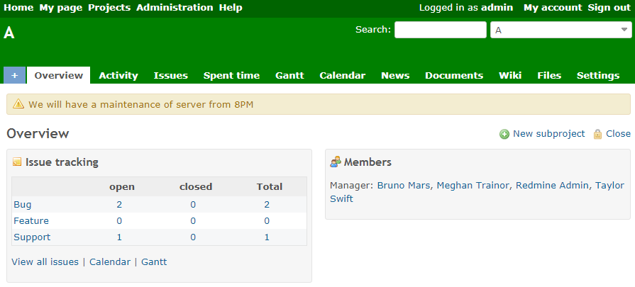

# Redmine view customize plugin

[Redmine](http://www.redmine.org)の画面をカスタマイズするためのプラグインです。

## 機能

条件に一致した画面に対して、JavaScript、CSSを埋め込むことで、画面をカスタマイズします。

## インストール方法

Redmineのプラグインディレクトリに、このリポジトリを`view_customize`としてクローンします。

```
cd {RAILS_ROOT}/plugins
git clone https://github.com/onozaty/redmine-view-customize.git view_customize
cd ../
bundle install --without development test
bundle exec rake redmine:plugins:migrate RAILS_ENV=production
```

**注意: ディレクトリ名は`view_customize`とする必要があります。ディレクトリ名が異なると、プラグインの実行に失敗します。**

## 使用方法

### 追加

プラグインをインストールすると、管理者メニューに「View customize」が追加されます。


「View customize」を押下すると、一覧画面に遷移します。


「New view customize」を押下し、各種項目を入力します。


「Path pattern」は正規表現で指定します。ページのパスと一致すると、コードを挿入して実行します。
以下は設定例です。
* `.*` : 全てのページ
* `/issues$` : チケット一覧
* `/issues/[0-9]+` : 個々のチケットの内容表示画面

「Insertion position」は、コードの挿入位置です。v1.2.0にて追加された項目になります。
* 「Head of all pages」 : 全てのページのヘッダ部分。(v1.2.0より前のバージョンと同じ位置)
* 「Bottom of issue form」 : チケットの入力欄の下部。<br>
チケットの入力欄は、トラッカーやステータスを変えると再構成されますが、「Bottom of issue form」を指定しておくと再構成された際に再度実行されるので、入力欄に対する処理はこれを指定すると便利です。
* 「Bottom of issue detail」 : チケットの詳細表示の下部。

該当ページにコードの挿入位置に該当する箇所が無かった場合、コードは埋め込まれません。たとえば、「Path pattern」で`.*`で全ページを指定しても、「Insertion position」に「Bottom of issue detail」を指定していると、チケットの詳細表示画面でしか実行されないことになります。

「Type」にてコードの種類(「JavaScript」または「CSS」)を選択し、「Code」に実際のコードを入力します。

「Comment」にはカスタマイズに対する概要を記載できます。ここで入力した内容は、一覧表示で表示されます。(Commentが入力されていればComment、Commentが入力されていない場合はCodeが一覧に表示)

「Create」ボタン押下で新規カスタマイズの追加が完了です。

「Path pattern」に一致したページで指定のコードが実行され、画面がカスタマイズされるようになります。



### 編集/削除


カスタマイズ一覧の番号を押下すると、カスタマイズ詳細画面へ遷移します。


「Delete」を押下すると削除できます。「Edit」を押下すると、編集画面へ遷移します。

入力項目は新規カスタマイズ作成時と同じです。

### 無効化 / プライベート

「Enabled」のチェックを外すと、無効化することができます。「Private」をチェックすると、作成者のみに有効となります。


まずは「Private」で動作確認したうえで、動作に問題なければ全体に公開するといった使い方ができます。

### ViewCustomize.context (JavaScript)

JavaScriptのコードでは、`ViewCustomize.context`としてユーザやプロジェクトの情報にアクセスすることができます。

`ViewCustomize.context`の情報は下記のようなイメージです。

```javascript
ViewCustomize = {
  "context": {
    "user": {
      "id": 1,
      "login": "admin",
      "admin": true,
      "firstname": "Redmine",
      "lastname": "Admin",
      "groups": [
        {"id": 5, "name": "Group1"}
      ],
      "apiKey": "3dd35b5ad8456d90d21ef882f7aea651d367a9d8",
      "customFields": [
        {"id": 1, "name": "[Custom field] Text", "value": "text"},
        {"id": 2, "name": "[Custom field] List", "value": ["B", "A"]},
        {"id": 3, "name": "[Custom field] Boolean", "value": "1"}
      ]
    },
    "project": {
      "identifier": "project-a",
      "name": "Project A",
      "roles": [
        {"id": 6, "name": "RoleX"}
      ]
    },
    "issue": {
      "id": 1
    }
  }
}
```

例えばユーザのAPIキーにアクセスするには`ViewCustomize.context.user.apiKey`となります。

## 設定例

* [onozaty/redmine\-view\-customize\-scripts: Script list for "Redmine View Customize Plugin"](https://github.com/onozaty/redmine-view-customize-scripts)

## サポートバージョン

* 最新バージョン : Redmine 3.1.x 以降
* 1.2.2 : Redmine 2.0.x から 3.4.x

## ライセンス

このプラグインは [GNU General Public License](http://www.gnu.org/licenses/gpl-2.0.html) バージョン2またはそれ以降の条件で利用できます。
