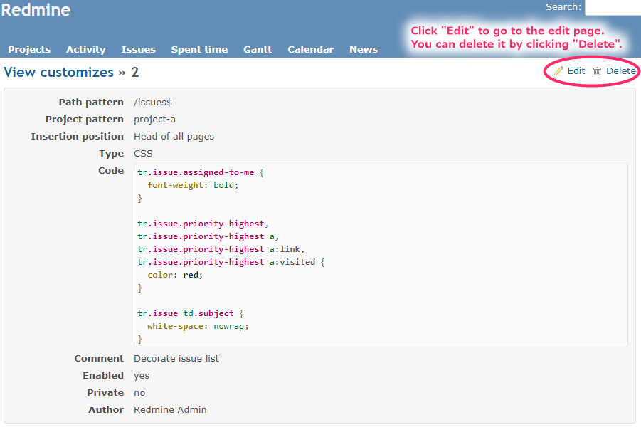

# Redmine view customize plugin

This a plugin allows you to customize the view for the [Redmine](http://www.redmine.org).

## Features

Customize the page by inserting JavaScript, CSS or HTML on the page that matched the condition.

## Installation

Install the plugin in your Redmine plugins directory, clone this repository as `view_customize`:

```
cd {RAILS_ROOT}/plugins
git clone https://github.com/onozaty/redmine-view-customize.git view_customize
cd ../
bundle install --without development test
bundle exec rake redmine:plugins:migrate RAILS_ENV=production
```

**note: The directory name must be a `view_customize`. Directory name is different, it will fail to run the Plugin.**

## Usage

### Add

When installing the plugin, "View customize" is added to the administrator menu.


Click "View customize" go to the list screen.


Click "New view customize" and enter items.


"Path pattern" is specified by regular expression. If it matches the path of the page, insert the code and execute it.

The following is an example.
* `.*` : All pages
* `/issues$` : Issue list
* `/issues/[0-9]+` : Issue detail page

"Insertion position" is the code insertion position. It becomes item added in v1.2.0.

* "Head of all pages" (The same position as the version before v1.2.0)
* "Bottom of issue form"<br>
Issue input fields are reconstructed when trackers or statuses are changed. If "Bottom of issue form" is specified, it will be executed again when reconstructed.
* "Bottom of issue detail"

If there is no part corresponding to the insertion position of the code on the page, the code is not insert.
For example, even if you specify `.*` in "Path pattern", if "Bottom of issue detail" is specified for "Insertion position", it will be executed only on the issue detail page.

In "Type", select the type of code ("JavaScript", "CSS" or "HTML") and enter the actual code in "Code".

For "Comment" you can put an overview on customization. The contents entered here are displayed in the list display.
When "Comment" is entered, "Comment" is displayed on the list.
If "Comment" is not entered, "Code" is displayed in the list.

Addition is completed by clicking "Create" button.

The specified code is executed on the page that matches "Path pattern", and the page will be customized.


### Edit / Delete


When you click the number of the customize list, go to the detail page.



You can delete it by clicking "Delete".

Click "Edit" to switch to the edit page.
The input item is the same as when creating a new one.

### Disable / Private

You can disable it by unchecking "Enabled". If you check "Private", it will be enable only for the author.


If you check the operation with "Private" and there is no problem in operation, it will be good to release it to the all.

### ViewCustomize.context (JavaScript)

You can access information on users and projects using `ViewCustomize.context`.

`ViewCustomize.context` is as follows.

```javascript
ViewCustomize = {
  "context": {
    "user": {
      "id": 1,
      "login": "admin",
      "admin": true,
      "firstname": "Redmine",
      "lastname": "Admin",
      "last_login_on": "2019-09-22T14:44:53Z",
      "groups": [
        {"id": 5, "name": "Group1"}
      ],
      "apiKey": "3dd35b5ad8456d90d21ef882f7aea651d367a9d8",
      "customFields": [
        {"id": 1, "name": "[Custom field] Text", "value": "text"},
        {"id": 2, "name": "[Custom field] List", "value": ["B", "A"]},
        {"id": 3, "name": "[Custom field] Boolean", "value": "1"}
      ]
    },
    "project": {
      "identifier": "project-a",
      "name": "Project A",
      "roles": [
        {"id": 6, "name": "RoleX"}
      ],
      "customFields": [
        {"id": 4, "name": "[Project Custom field] Text", "value": "text"}
      ]
    },
    "issue": {
      "id": 1
    }
  }
}
```

For example, to access the user's API key is `ViewCustomize.context.user.apiKey`.

## Examples

* [onozaty/redmine\-view\-customize\-scripts: Script list for "Redmine View Customize Plugin"](https://github.com/onozaty/redmine-view-customize-scripts)

## Supported versions

* Current version : Redmine 3.1.x - 3.4.x, 4.0.x or later
* 1.2.2 : Redmine 2.0.x - 3.4.x

## License

The plugin is available under the terms of the [GNU General Public License](http://www.gnu.org/licenses/gpl-2.0.html), version 2 or later.
